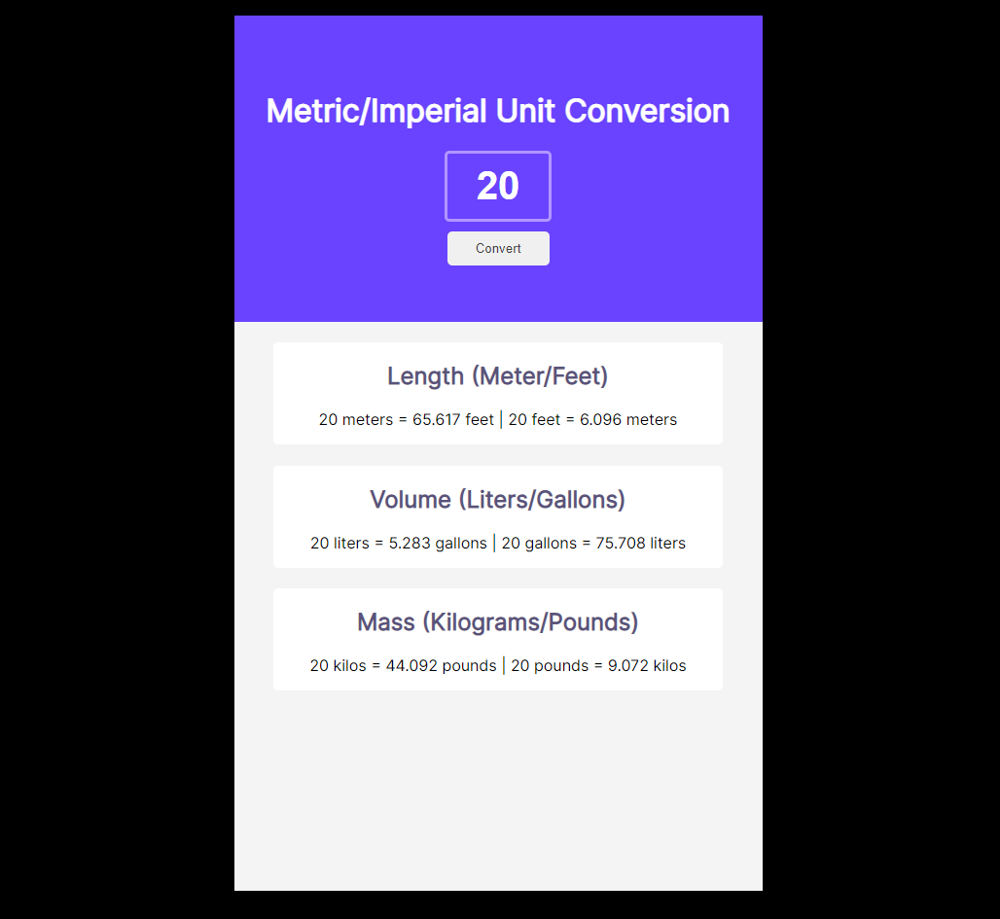

# Scrimba - Chrome extension leads tracker solution

This is a solution to the [Unit converter project - Solo Project on Scrimba](https://scrimba.com/learn/frontend/solo-project-unit-converter-cz9aPNSr). Scrimba helps you improve your coding skills by building realistic projects.

## Table of contents
- [Overview](#overview)
  - [The challenge](#the-challenge)
  - [Screenshot](#screenshot)
  - [Links](#links)
  - [How to install](#how-to-install)
- [My process](#my-process)
  - [Built with](#built-with)
  - [What I learned](#what-i-learned)
  - [Useful resources](#useful-resources)

## Overview

### The challenge

Users should be able to:

- Generate all conversions when the user clicks "convert"
- Round the number down to three decimal places

### Screenshot

### Links

- Solution URL: [Unit-Conversion - GitHub](https://github.com/memo-ibrahim-alean/Unit-Conversion)
- Live Site URL: [Unit-Conversion](https://memo-ibrahim-alean.github.io/Unit-Conversion/)

### How to install

- Clone Repo or Download Zip
- That's it! 🎉

## My process

### Built with

- HTML
- CSS
- Mobile-first workflow
- Vanilla Javascript

### What I learned

With this project I improved a lot my JS skills.

